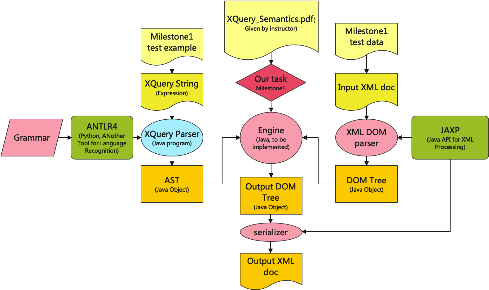
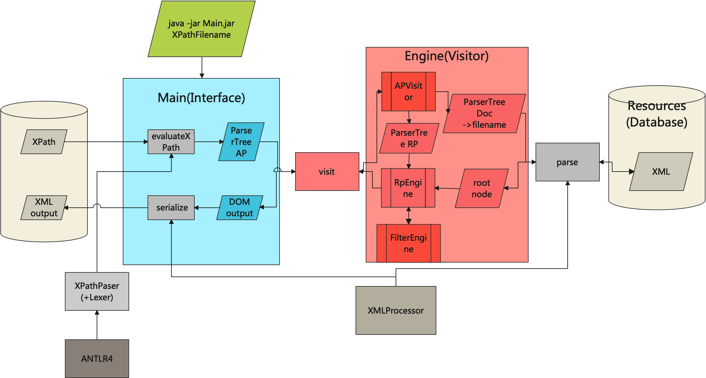

# ucsd_cse232b_project
A xquery processor for ucsd cse 232b courser project
## Project file structure
1. Docs: contains first hand from ucsd cse 232b course or helpful notes of collaborator
2. Maven java project structure
	- src
		- main
			- antlr
			- java
			- resources
				- j_caesar.xml
		- test
			- resources
				- XPath0.txt
	- target
		- CSE-232B-M1.jar

## [Milestone 1](https://github.com/champion-chenpeng/ucsd_cse232b_xquery/milestone/1)
Due by Feb 7, finish naive xpath evaluator.

### Finished
1. packaged XPathEvaluator
	- (under root dir):
	- compile and package:(no test now)
		-		mvn package
	- usage
		- 		java -jar target/CSE-232B-M1.jar src/test/resources/XPath0.txt
	- then the xpath_result.xml will appear under root dir

### TBD
1. Optimize the implementation the project. (To make sure originality), directions:
	- OOD, 
		- ex. remove helpers etc
	- simplicity,
		- ex. use regular expression in .g4 (|) to simply it
2. add tests to cover all the test case from instructor
	- 5 xpath query string
	- additional query
	- Autometically check the answer? (manually is acceptible)

### Project Architecture

#### Pink parts - to be implement
1. Engine: the key part of the project. Instruction says we just need to convert the pseudo-code in the [semantics specification](Docs/Milestone12_xpath_semantics.pdf).
2. Grammar: according to ANTLR 4, we need a .g4 file to describe the grammar of XQuery(XPath for milestome 1) and convert it to a XQuery Parser. Also refer to [semantics specification](Docs/Milestone12_xpath_semantics.pdf).
3. XML-DOM parser and DOM-XML serializer: using JAXP(Java API for XML Processing) to finish these two parts(several lines of code). Please refer to related Java documents.
#### Other parts
1. Yellow parts: input (files)
2. Orange parts: (intermediate) output (files)
3. Green parts: 3rd party tools
4. Blue parts: output program

### Project Design

#### Entry
		java -jar M1.jar XPathFilename.txt

#### Main
The main interface, give argvs, get output xml file.

#### Engine(Visitor)
The engine, put parser tree(AST) into visit method of the engine, get the output DOM nodes.

#### XMLProcessor
XML-DOM parser and serializer.
